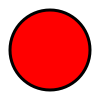
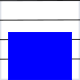

# Webserver für Arduino

## MKR1000 WIFI mit MKR SD Proto Shield

Entweder man benutzt eine Cloude oder speichert die Daten lokal in einer SD Karte.

Diese Projekt beinhaltet einen Webserver mit Zugriff auf das Web Directory der SD Karte.

-   SD Root
    -   PROPERTY.PRP \\\\ [File mit MIME-TYPE des Webserver](https://wiki.selfhtml.org/wiki/MIME-Type/%C3%9Cbersicht)
    -   Web \\\\ Root Directory  des Webservers
        -   LOG \\\\ Directory des logging tools
            -   20180825.CSV \\\\ Erstellt täglich ein File mit 5 Minuten Werte
        -   JS \\\\ Directory für Javascript Files
        -   MKR \\\\ Directory mit speziellen Befehlen

Zusätzlich hat der Webserver noch folgenden Funktionen.

-   <http://mkr/MKR/DIR(>) liest alle File auf der SD Karte ab dem Directory WEB als CSV File
    -   INDEX.HTM,IMG,IMG/OFF.SVG,IMG/OFF2.SVG,IMG/ON2.SVG,IMG/ON.SVG,IMG/OFF1.SVG,IMG/ON1.SVG,JS,JS/DO.JS,JS/DI.JS,JS/AI.JS,LOG,LOG/20180825.CSV,LOG/20180804.CSV,LOG/20180901.CSV,LOG/20180826.CSV,LOG/19700101.CSV,LOG/20180902.CSV,LOG/20180908.CSV,LOG/20180909.CSV,LOG/20180915.CSV,FAVICON.ICO,LOG.HTM,OS.HTM
-   <http://mkr/MKR/GETDIO(pin>) Liest den Status des Digitalen Pin  (0-14) des MKR100 als CSV File
    -   1
-   <http://mkr/MKR/GETDIO(>) Liest den Status der Digitalen Pin  (0-14) des MKR100 als CSV File
    -   0,1,0,0,1,1,0,1,0,0,0,1,1,1,1
-   <http://mkr/MKR/SETDIO(pin,value>) Setzt den Status des Digitalen Pins (0-14) des MKR100 mit value HIGH 1 or LOW 0 return 1 erfolgreich 0 nicht erfolgreich
    \-1
-   <http://mkr/MKR/GETAIO(pin>) Liest den Wert des Analogen Pin (0-6) des MKR100 als CSV File Werten von 0-1023
    -   143
-   <http://mkr/MKR/GETAIO(>) Liest den Wert der Analogen Pins (0-6) des MKR100 als CSV File Werten von 0-1023
    -   608,440,507,182,421,316,240
-   <http://mkr/MKR/GETDATA(pin>) Liest 512 Werte inkl. Zeit in Mikrosekunden des Analogen Pin (0-6) des MKR100 als CSV File Werten von 0-1023
    -   0,466
    -   422,440
    -   844,360
    -   1266,377
    -   ...

Das Arduino Projekt besteht aus dem Komponenten:

## WebServer

Der Webserver stellt die Webserverfunktionalität zur Verfügung. Inkl. der oben erwähnten MKR Funktionalität welche in der Klasse MKRRequest definiert wurden.
Um den Webserver starten zu können benenne das File arduino_secrets_.h in arduino_secrets.h um und ergänze die WIFI Zugangsdaten.

## Recorder

Der Recorder speichert alle 15 Minuten die Analogwerte in File YYYYMMDD.CSV

## HTML

Für die Darstellung auf einer Webseite stehen die Javascript Klassen **DI,DO,AI** zur Verfügung. Sie sind folgendermassen in das HTML File einzubinden:

```javascript
<script type="text/javascript" src="js/DO.js"></script>
<script type="text/javascript" src="js/DI.js"></script>
<script type="text/javascript" src="js/AI.js"></script>
```

und müssen folgendermassen initialisiert werden:

```javascript
<script>
function interval() {
    aISetValue();
    dISetValue();
    dOSetValue();
}

function onLoad() {
    new DO(document.getElementById(String("do1" )), 1,"img/on.svg", "img/off.svg", "50");
    new DI(document.getElementById(String("di1" )), 1 "img/on2.svg", "img/off2.svg", "50");
    new AI(document.getElementById(String("ai1" )), 1, 10000, 50);
    setInterval(interval, 2000);
}
 </script>
```
```html
<div id="do1"></div>
<div id="di1"></div>
<div id="ai1"></div>
```
und sieht dann folgendermassen aus

 oder 

 oder 



## Google Charts
Es ist möglich mittels Google Chart die geloggten Daten darzustellen.

```html
<script type="text/javascript" src="https://www.gstatic.com/charts/loader.js"></script>
<script src="https://ajax.googleapis.com/ajax/libs/jquery/3.3.1/jquery.min.js"></script>

<script type="text/javascript">
    google.charts.load('current', {'packages': ['corechart', 'calendar']});
    google.charts.setOnLoadCallback(drawChartLine);
    google.charts.setOnLoadCallback(drawChartData);
    google.charts.setOnLoadCallback(drawChartDD);
    var datum = new Date();
    var dat = "LOG/" + datum.getFullYear() + ((datum.getMonth() < 9) ? "0" : "") + (datum.getMonth() + 1) + ((datum.getDate() < 10) ? "0" : "") + (datum.getDate()) + ".CSV";
    function fx_z(p1, p2) {
        switch (p2) {
            case 0:
                return (p1 / 0.5);
                break;
            case 1:
                return (p1 / 2.5);
                break;
            case 2:
                return (p1 / 0.5);
                break;
            case 3:
                return (p1 / 2.5);
                break;
            case 4:
                return (p1 / 0.5);
                break;
            case 5:
                return (p1 / 2.5);
                break;
            case 6:
                return (p1 / 0.5);
                break;
            default:
                return p1;
        }
    }

    function drawChartDD() {
        $.get('MKR/GETDATA(2)', function (csvString) {
            var data = new google.visualization.DataTable();
            data.addColumn('number', "zeit");
            data.addColumn('number', "data");
            var arr1 = csvString.split('\n');
            data.addRows(arr1.length);
            arr1.forEach(function (item1, index) {
                var arr = item1.split(",");
                data.setCell(index, 0, arr[0]);
                data.setCell(index, 1, arr[1]);
            });
            var options = {
                curveType: 'function',
                legend: {position: 'bottom'},
                vAxis: {title: 'Wert'},
                hAxis: {title: 'Zeit'}
            };
            var chart = new google.visualization.LineChart(document.getElementById('dd_chart'));
            chart.draw(data, options);
        });
    }
    function drawChartLine() {
        $.get(dat, function (csvString) {
            var data = new google.visualization.DataTable();
            data.addColumn('datetime', 'Datum');
            data.addColumn('number', "0");
            data.addColumn('number', "1");
            data.addColumn('number', "2");
            data.addColumn('number', "3");
            data.addColumn('number', "4");
            data.addColumn('number', "5");
            data.addColumn('number', "6");
            var array = csvString.split("\n");
            data.addRows(array.length);
            for (i = 0; i < array.length; i++) {
                var row = array[i].split(",");
                var da = new Date();
                da = new Date(row[0]);
                data.setCell(i, 0, da);
                for (x = 1; x < row.length; x++) {
                    data.setCell(i, x, fx_z(row[x], x - 1));
                }
            }

            var options = {
                title: 'Ueberschrift'.concat(" ").concat(datum.getDate()).concat(".").concat(datum.getMonth() + 1).concat(".").concat(datum.getFullYear()),
                curveType: 'function',
                legend: {position: 'bottom'},
                vAxis: {title: 'Wert'},
                hAxis: {title: 'Datum'}
            };
            var chart = new google.visualization.LineChart(document.getElementById('curve_chart'));
            chart.draw(data, options);
        });
    }

    function drawChartData() {
        $.get('MKR/DIR()', function (csvString) {
            var chart = new google.visualization.Calendar(document.getElementById('calendar_basic'));
            var array2 = [""];
            var datArray = [
                [new Date(), 1]
            ];
            var dataTable = new google.visualization.DataTable();
            dataTable.addColumn({
                type: 'date',
                id: 'Date'
            });
            dataTable.addColumn({
                type: 'number',
                id: 'Day'
            });
            datArray[0] = [new Date(), 1];
            dataTable.addRows(datArray);
            var options = {
                title: "Daten vorhanden",
                height: 350
            };
            google.visualization.events.addListener(chart, 'select', function () {
                var selection = chart.getSelection();
                if (selection.length) {
                    var row = selection[0].row;
                    if (row) {
                        datum = new Date(selection[0].date);
                        dat = "LOG/" + datum.getFullYear() + ((datum.getMonth() < 9) ? "0" : "") + (datum.getMonth() + 1) + ((datum.getDate() < 10) ? "0" : "") + (datum.getDate()) + ".CSV";
                        drawChartLine();
                    }
                }
            });
            csvString = csvString.substr(0, csvString.length - 2);
            array2 = csvString.split(",");
            lauf = 0;
            for (i = 0; i < array2.length; i++) {
                try {
                    if (array2[i].endsWith(".CSV")) {
                        array2[i] = array2[i].replace("LOG/", "");
                        array2[i] = array2[i].replace("1\r\n", "");
                        var datums = new Date(array2[i].substr(0, 4), array2[i].substr(4, 2) - 1, array2[i].substr(6, 2));
                        if (datums.getFullYear() > 2016) {
                            datArray[lauf] = [datums, ((i % 2) === 0) ? 1 : -1];
                            lauf++;
                        }
                    }
                } catch (err) {

                }
            }
            dataTable.addRows(datArray);
            chart.draw(dataTable, options);
        });
    }
    </script>

    <table  style="width: 100%">
        <tr>
            <td><div id="curve_chart"></div></td>
        </tr>
        <tr>
            <td> <div id="calendar_basic"  ></div></td>
        </tr>
        <tr>
            <td> <div id="dd_chart"  ></div></td>
        </tr>
    </table>
```

mit folgendem Resultat
